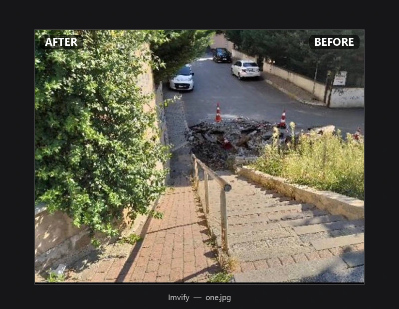

# Imvify

A Windows desktop app that restores old, low-quality photos — cleans up noise, blur, and compression artifacts, and brings back detail, without changing the image's original size.



## Features

- Open a single photo or a whole batch (drag & drop, or pick multiple files at once)
- Three restoration models to pick from 
- Before/after comparison with a draggable slider, zoom/pan, and a quick-flicker toggle
- Runs on GPU (CUDA) when available, falls back to CPU

## Usage

```bash
python main.py
```

Open an image (or several), pick a model, hit Run. Drag the slider over the result to compare it against the original, then save.

You can also run the engine directly from the command line, no UI needed:

```bash
python -m engine.enhance input.jpg output.png --model swinir-m
```

`--model` is one of `realesr-general-x4v3`, `bsrgan`, `swinir-m` (default `swinir-m`). `--tile-size` and `--padding` control the tiled inference used for large images.

## Setup

```bash
python -m venv venv
venv\Scripts\activate

# torch/torchvision need PyTorch's own index for CUDA builds:
pip install torch torchvision --index-url https://download.pytorch.org/whl/cu126
# CPU-only machines can just do:
# pip install torch torchvision

pip install -r requirements.txt
```

Model weights aren't included in the repo — drop these into `engine/weights/`:
- `realesr-general-x4v3.pth` and `realesr-general-wdn-x4v3.pth` from [Real-ESRGAN](https://github.com/xinntao/Real-ESRGAN)
- `SwinIR-M_x4_GAN.pth` from [SwinIR](https://github.com/JingyunLiang/SwinIR)
- `BSRGAN.pth` from [BSRGAN](https://github.com/cszn/BSRGAN)

## Models

| Model | Architecture | Notes |
|---|---|---|
| `realesr-general-x4v3` | SRVGG (Real-ESRGAN) | Fastest, supports blending in a denoise variant |
| `bsrgan` | RRDBNet (BSRGAN) | Same family as the original ESRGAN, mid-speed |
| `swinir-m` | SwinIR | Heaviest, needs a smaller tile size |

All three are real-world super-resolution models — trained on genuinely degraded photos rather than simple downscaling, which is what actually matters for restoring old images.

Keeping `engine/` UI-free means it could be dropped behind a different UI, or a service, without a rewrite.

## Testing

```bash
pip install pytest
python -m pytest tests/ -v
```

## Credits

Model architectures (`SRVGGNetCompact`, `SwinIR`, `RRDBNet`) are vendored from their original repos, trimmed to drop the `basicsr`/`realesrgan`/`timm` dependencies:
- [Real-ESRGAN](https://github.com/xinntao/Real-ESRGAN) (BSD-3-Clause)
- [SwinIR](https://github.com/JingyunLiang/SwinIR) (Apache-2.0)
- [BSRGAN](https://github.com/cszn/BSRGAN) (Apache-2.0)
